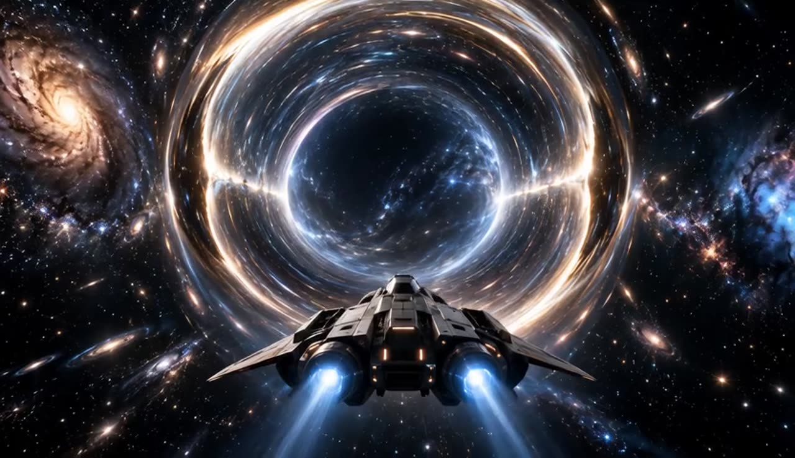
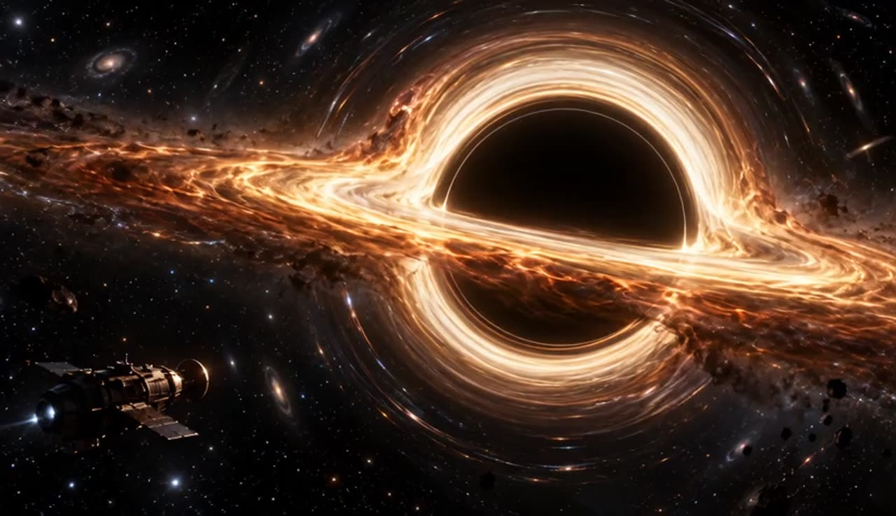
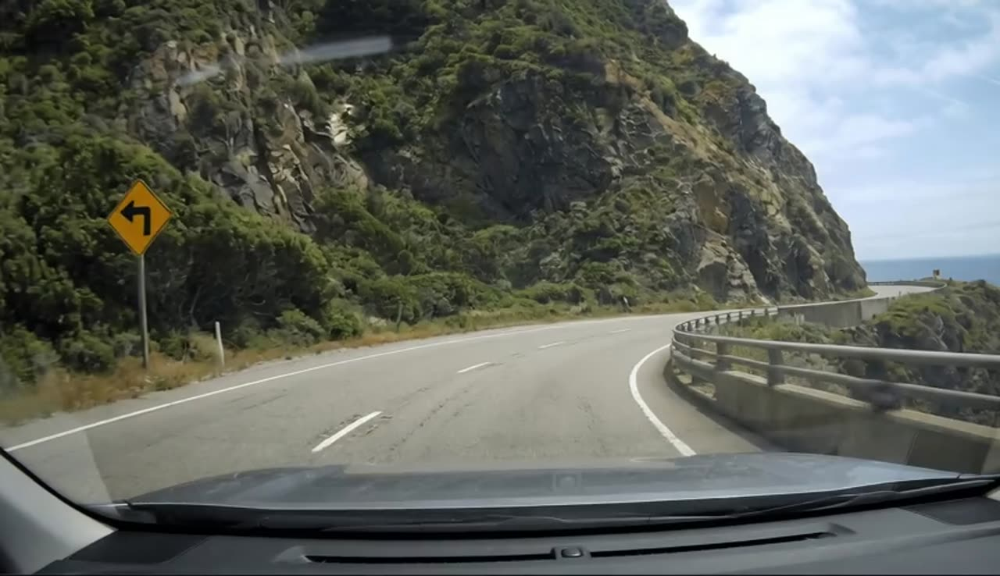
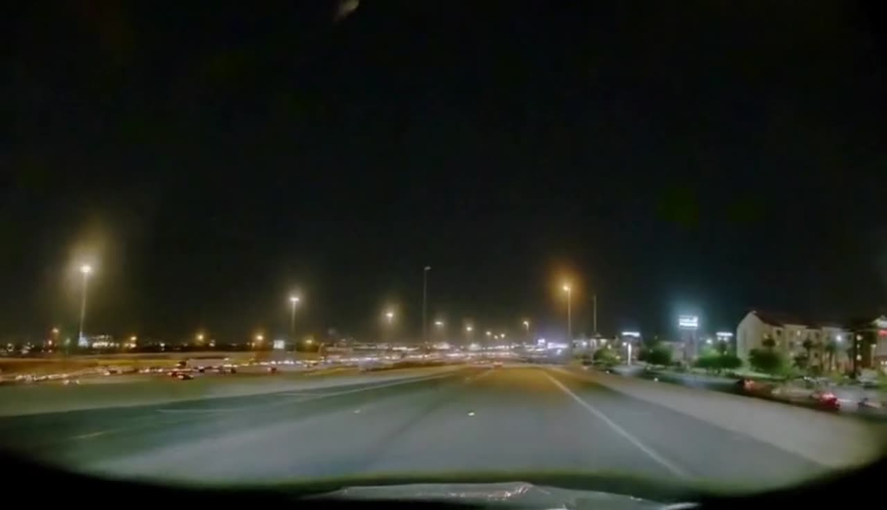
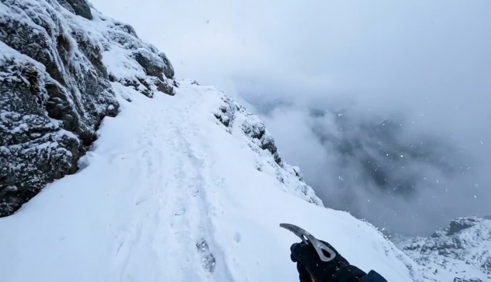
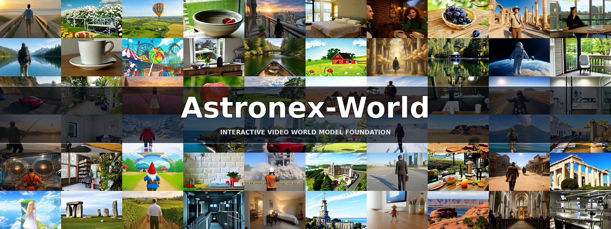

# Astronex-World

Inference, evaluation and post-training for **Astronex-World-5B**: a real-time interactive video world model for
autonomous driving and embodied intelligence, with camera, action, event and text control on a Wan2.2-TI2V-5B
backbone. 832x480 and 1280x704 at 24 fps.

[Project page](https://world.astronex.com.cn/) &nbsp;|&nbsp;
[Code](https://github.com/Astronex-Robotics/Astronex-World) &nbsp;|&nbsp;
[Weights](https://huggingface.co/Astronex-Lab/Astronex-World)

The weights live next door in `../Astronex`; this is the code that runs them and continues training them.

## Gallery

Every clip below is generated by the released weights. Click a frame to play it.

| | | |
|:---:|:---:|:---:|
| [](https://world.astronex.com.cn/assets/videos/Astronex_01_720p24.mp4) | [](https://world.astronex.com.cn/assets/videos/Astronex_04_720p24.mp4) | [](https://world.astronex.com.cn/assets/videos/Astronex_08_480p.mp4) |
| [](https://world.astronex.com.cn/assets/videos/Astronex_09_480p.mp4) | [](https://world.astronex.com.cn/assets/videos/Astronex_10_480p.mp4) | [](https://world.astronex.com.cn/assets/videos/Astronex_11_480p.mp4) |
| [](https://world.astronex.com.cn/assets/videos/Astronex_12_480p.mp4) | [](https://world.astronex.com.cn/assets/videos/Astronex_13_480p.mp4) | [](https://world.astronex.com.cn/assets/videos/cosmos-coast.mp4) |
| [](https://world.astronex.com.cn/assets/videos/cosmos-night.mp4) | [](https://world.astronex.com.cn/assets/videos/snow-mountain.mp4) | [](https://world.astronex.com.cn/assets/videos/long-horizon-30s.mp4) |



More clips — action-controlled driving, night roads, snow ridges and a 33-second continuous rollout — are on the
[project page](https://world.astronex.com.cn/).

```
inference/generate.py        causal or bidirectional generation, with events
inference/causal.yaml        8 steps, window 20, sink 4, retrieval on
inference/bidirectional.yaml 50 steps, full-sequence attention
post_train/train.py          --recipe sft | dmd, single or multi node
post_train/configs/          sft.yaml, dmd.yaml
post_train/README.md         the objective, the memory budget, two silent traps
wan/check_components.py      verify the VAE and text encoder are where they go
wan/README.md                what Astronex replaces and what it reuses
scripts/                     runnable examples of everything above
astronex_env.py              locates the minWM tree and the released weights
```

`astronex_env.py` expects the minWM checkout as a sibling directory; point `MINWM_ROOT` elsewhere if it is not. Start
here:

```bash
python wan/check_components.py
```

The release is the denoiser only. The Wan2.2 VAE and the UMT5 text encoder come from minWM's `ckpts/` and are not
duplicated — and they resolve from a *different* directory than the backbone config, which `wan/README.md` explains
because it is the one bit of the layout that reliably wastes an afternoon.

## Two inference modes

Both run the same 5B backbone. They differ in what attention can see, and everything else follows.

| | causal | bidirectional |
|---|---|---|
| attention | backwards, 20-frame sliding window, 4-frame sink | whole clip at once |
| sampler | 8 steps | 50 steps |
| guidance | 3.0 | 8.0 |
| length | extendable indefinitely, block by block | fixed at the window |
| driveable while running | yes | no |
| action control | yes | yes |
| weights | `../Astronex` | `../Astronex` (the same files; `--weights` overrides) |

Both forms sample the same checkpoint directory. The checkpoint carries 892 tensors, seven of which are the action
pathway, and both configs enable it (`use_action: true`), so either form loads it strictly with no missing weights.
Pass `--weights <dir>` to sample from somewhere else.

The causal form is the distilled student; the bidirectional form keeps the teacher's full motion.
**Causal for interaction and length, bidirectional when the motion has to be exact.**

```bash
# causal, driven forward
python inference/generate.py --mode causal \
  --prompt "A wooden sailing ship on a stormy sea at dusk." \
  --image ../minWM/data/wbench/images/case_203.jpg \
  --trajectory 'w*23' --out outputs/pirate

# bidirectional, same prompt
python inference/generate.py --mode bidirectional \
  --prompt "A wooden sailing ship on a stormy sea at dusk." \
  --image ../minWM/data/wbench/images/case_203.jpg \
  --frames 20 --out outputs/pirate_bidir
```

Omit `--image` for text-to-video. `--trajectory` is a per-frame camera stream (`w` forward, `s` back, `a`/`d` strafe,
`h` hold; `w*12,a*11` turns partway through) whose length must equal the frame count — it defaults to holding still.

Two settings are worth respecting:

- **8 causal steps** is the validated setting. The sampler also accepts 4 steps for latency experiments; quality is
  lower and every number reported below uses 8.
- **Frames come in whole blocks.** The causal pipeline generates in blocks of 8 and i2v spends one frame on the
  reference, so `1 + frames` divides by 8: 23, not 20. `generate.py` snaps and says so rather than failing three
  minutes into loading.

## Events

An event is a second caption that takes effect partway through the rollout, so the scene establishes itself first and
then something happens in it.

```bash
python inference/generate.py --mode causal \
  --prompt "A grand magical library, tall shelves and floating candles, a wizard at a reading desk." \
  --event-prompt "The wizard picks up the crystal staff." \
  --event-start-frame 8 --out outputs/event
```

From `--event-start-frame` onward the caption switches and the cross-attention cache is invalidated so the new text takes
effect. Measured against an otherwise identical event-free run: frames before the switch differ by a mean of 1.8/255,
frames after by 9.5/255 — the event is confined to where it was asked for. Two things about the event text that are not
obvious:

- **It is appended to the caption, never substituted.** The release has no dedicated event branch, so the event reaches
  the model through the same caption cross-attention as everything else (`event_in_caption: true` in `causal.yaml`).
- **It has to stay in plain language.** "The wizard picks up the crystal staff" works; rewriting the same instruction
  into abstract technical vocabulary stops it triggering.

## Action-sequence output

`action_output` is public in this release: enabling it attaches a `LayerNorm -> Linear -> SiLU -> Linear` head that
mean-pools the spatial tokens of each latent frame and predicts a 64-D action vector, giving `(B, F, 64)`. The output
layer is zero-initialised, so inserting the head leaves the video model unchanged, and `stage1` above is the recipe that
trains it — `camera_diffusion.py` is the only trainer carrying the action-prediction loss, and asking for it under DMD
is refused rather than silently left without a gradient.

That makes the model usable as an inverse-dynamics readout: predicted states to actions, alongside actions to predicted
states. Embodiment-specific adapters connect the generic 64-D interface to joints, end effectors, grippers or a mobile
base.

## Post-training

Four recipes, one per stage this model was actually built through. Which control pathways train is a property of the
stage rather than a free choice — each config is a copy of one that ran here.

| recipe | trainer | trains |
|---|---|---|
| `stage0` | `camera_bidirectional_diffusion` | adapters + every graft (this produces the teacher) |
| `stage1` | `camera_diffusion` | action, event, action_out |
| `sft` | `camera_diffusion` | camera, action |
| `dmd` | `camera_score_distillation` | adapters only (this produces the streaming release) |

```bash
python post_train/train.py --recipe sft --gpus 2 --trainchk
python post_train/train.py --recipe dmd --gpus 2 --trainchk
```

Each starts from the released weights with a fresh adapter, so step 0 reproduces the release. NCCL is the backend;
`--nnodes`/`--node-rank`/`--master-addr` extend it across hosts and `--sp-size` shards the sequence.
`post_train/README.md` has the objective term by term, the memory budget, the multi-node invocation, and two silent
failure modes worth reading before changing anything.

## Benchmarks

WBench (official evaluation code, default VLM judge) and VBench 1.0 (a partial run of the official suites, generated in suite order), both with the 8-step causal release:

| Benchmark | Setting | Score |
|---|---|---|
| WBench | Navi 158 average | **73.5** (Quality 78.2 / Setting 73.5 / Interaction 63.4 / Consistency 83.6 / Physical 68.6) |
| WBench | Full 289 average | **70.0** (Quality 78.3 / Setting 73.8 / Interaction 47.6 / Consistency 82.4 / Physical 68.1) |
| VBench 1.0 | Text-to-video, 240 videos | motion smoothness 0.990, temporal flickering 0.987, imaging 0.715 |
| VBench 1.0 | Image-to-video, 15 videos | I2V background 0.997, temporal flickering 0.995, background consistency 0.985 |

Scores are from our own run with the official WBench code and have been submitted to the leaderboard. Camera and action control
work, long rollouts hold their scene, and inference is real time on a single NVIDIA L20 48 GB: the causal form streams
block by block with cross-block KV caching and few-step UniPC sampling.

<!-- Citation: add the technical-report BibTeX entry here once the preprint is posted. -->

## License

Released under the Apache License, Version 2.0 — see [LICENSE](LICENSE). Copyright 2026 Astronex Robotics. The released
model weights are distributed under the same licence.
